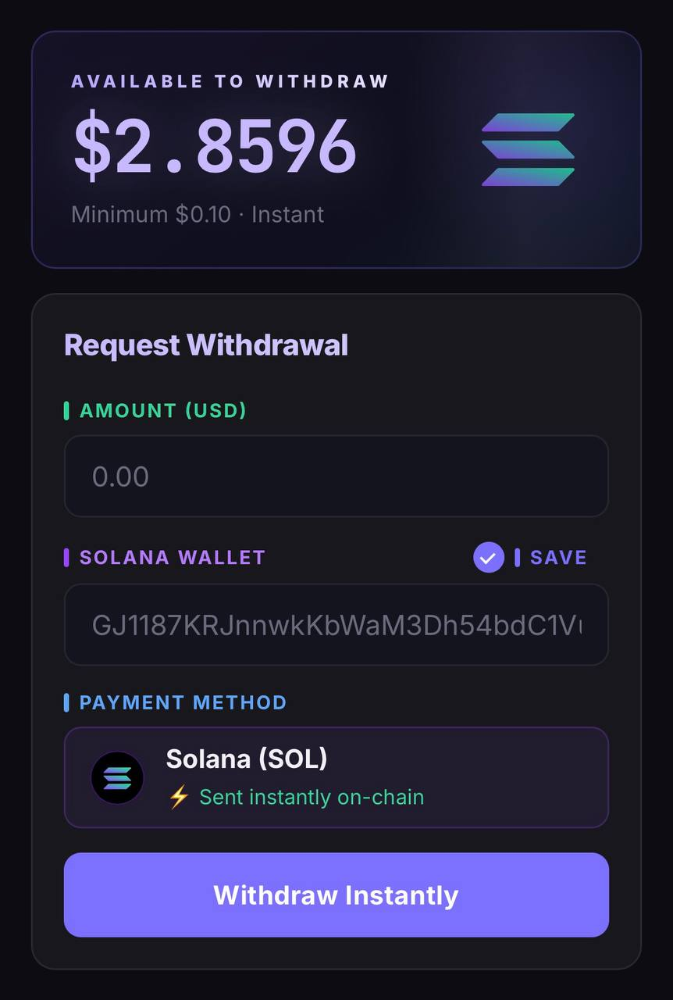

# DonutSMP Market

A Telegram Mini App + automated Minecraft bot that buys skeleton spawners and Donut Money from DonutSMP players and pays them instantly in Solana.

Players sell their in-game items through the app, the bot collects them in-game, and they cash out to their Solana wallet — no trust required, fully automated.

Built with Node.js, Mineflayer, Telegraf, and the Solana Web3 SDK.



---

## How it works

**Selling spawners:**
1. Player opens the Telegram Mini App, links their Minecraft username, and places a sell order
2. The in-game bot sends them a `/tpa` request on DonutSMP
3. Player accepts and drops their skeleton spawners on the ground
4. Bot picks up the spawners (throws back anything that isn't a spawner), then returns home via `/home`
5. Bot deposits the spawners into its ender chest
6. Player's USD balance is credited instantly (`quantity × spawner price`)

**Selling Donut Money (in-game coins):**
1. Player uses `/pay <bot>` in-game to send coins directly to the bot
2. Bot detects the payment from chat automatically
3. Player's USD balance is credited (`coins ÷ 1M × coin price`)

**Withdrawing:**
- Player opens the app, enters their Solana wallet address and withdrawal amount
- Payout is sent on-chain via the bot's Solana wallet

The owner accumulates spawners and coins bought at the market price and resells them at a higher price elsewhere — the spread is the profit.

---

## Stack

| Layer | Tech |
|---|---|
| In-game automation | [Mineflayer](https://github.com/PrismarineJS/mineflayer) + mineflayer-pathfinder |
| Telegram bot + Mini App | [Telegraf](https://telegraf.js.org) |
| Payments | [Solana Web3.js](https://solana-labs.github.io/solana-web3.js/) |
| Database | better-sqlite3 |
| Web server | Express |

---

## Project structure

```
src/
├── index.js              — entry point, boots all services
├── minecraft/bot.js      — in-game bot (TPA, item collection, /home, ender chest deposit)
├── telegram/bot.js       — Telegram commands, admin panel
├── webapp/               — Mini App UI (balance, sell flow, withdrawal)
├── payments/solana.js    — on-chain Solana payout logic
├── transactions/         — trade state machine, event handling
└── database/db.js        — users, orders, balances, withdrawals
```

---

## Setup

### Requirements

- Node.js 18+
- A dedicated Java Edition Minecraft account for the bot
- A Telegram bot token (from [@BotFather](https://t.me/BotFather))
- A Solana wallet (export private key from Phantom)

### Install

```bash
git clone https://github.com/Belingerul/donutsmp-market
cd donutsmp-market
npm install
cp .env.example .env
# Fill in .env with your credentials
npm start
```

### First run — Minecraft login

On first start you'll see a Microsoft device auth prompt:

```
To sign in, open https://www.microsoft.com/link and enter the code XXXX-XXXX
```

Open the link and log in with the bot account's Microsoft credentials. This only happens once — the session is cached.

### Set the bot's home in-game

The bot needs a home location with an ender chest nearby to deposit collected items:

1. Log into DonutSMP on the bot account
2. Place an **ender chest** within a few blocks of where you're standing
3. Run `/sethome 1`

### Connect the Mini App

In [@BotFather](https://t.me/BotFather):  
`/mybots → your bot → Bot Settings → Menu Button → Configure menu button`  
Set the URL to your `WEBAPP_URL` from `.env`.

---

## Configuration

Copy `.env.example` to `.env` and fill in:

| Variable | Description |
|---|---|
| `TELEGRAM_BOT_TOKEN` | Token from BotFather |
| `ADMIN_TELEGRAM_ID` | Your Telegram user ID (get from [@userinfobot](https://t.me/userinfobot)) |
| `WEBAPP_URL` | Public URL for the Mini App (ngrok, Cloudflare Tunnel, or VPS) |
| `MC_USERNAME` | Microsoft email for the bot's Minecraft account |
| `MC_SERVER` | Server address |
| `MC_VERSION` | Server Minecraft version |
| `PRICE_SPAWNER` | Price per spawner you pay out (in USD) |
| `PRICE_1M_COINS` | Price per 1M Donut Money you pay out (in USD) |
| `SOLANA_PRIVATE_KEY` | Base58 private key from Phantom |
| `SOLANA_RPC_URL` | RPC endpoint (default: mainnet-beta public) |

---

## Running 24/7

Deploy to a cheap VPS (Hetzner or DigitalOcean, ~$4–6/month) and use PM2:

```bash
npm install -g pm2
pm2 start src/index.js --name donutmarket
pm2 save && pm2 startup
```

---

## Common issues

| Problem | Fix |
|---|---|
| `npm install` fails with build error | Ubuntu: `sudo apt install build-essential python3` / Windows: `npm install -g windows-build-tools` |
| Bot connects then immediately drops | Log into the server manually on the bot account at least once first |
| Mini App shows white screen | Confirm `npm start` is running and `WEBAPP_URL` in BotFather matches `.env` exactly |
| Microsoft login code expired | Re-run `npm start` for a fresh code |
